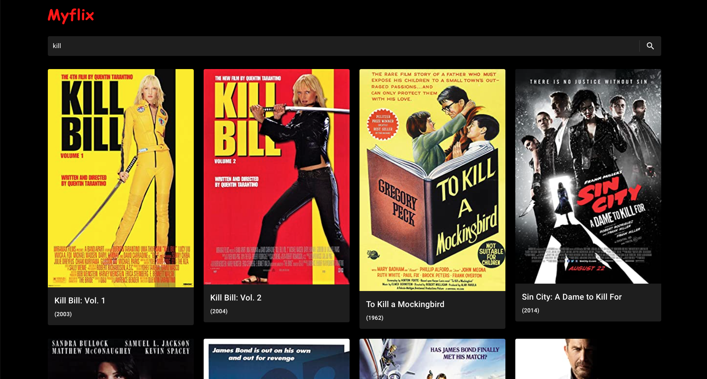

# Myflix application

## Myflix app searches movies with the help of OMDb API

This project was bootstrapped with [Create React App](https://github.com/facebook/create-react-app) and with the help
of [material UI](https://mui.com/) as the component library.
## Project setup:
#### `yarn install` to install dependencies.

## Project start:
#### `yarn start`

**Yes the Myflix logo is comic sans :)**
